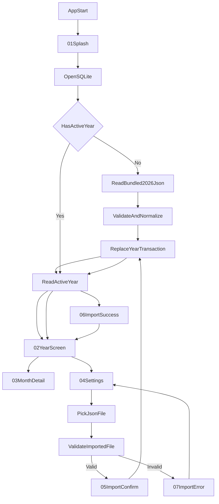

# Глобальный план разработки Calendar App

Документ фиксирует общий порядок разработки приложения на основе текущего дизайна в `pencil-new.pen`, требований проекта и потока данных `JSON -> SQLite -> UI`.

## Цель

Построить офлайн-first Android-приложение на `React Native 0.84` с такими принципами:

- `SQLite` является каноническим источником данных активного календаря.
- `JSON` используется как транспорт импорта и как источник первичного сида `2026`.
- После запуска приложение показывает `Splash`, затем годовой календарь.
- Пользователь может открыть месяц, посмотреть итоги, сменить тему и импортировать новый год из локального `JSON`.

## Дизайн-опора

План опирается на уже подготовленные экраны в `pencil-new.pen`:

- `89qZM`, `LhP6Y` — `Splash`
- `ZOx5s`, `vqkC5` — `Year 2026`
- `Qewj3`, `i0DfK` — `Month detail`
- `X7ItR`, `TKvmB` — `Settings`
- `vkTRt` — `Import confirm`
- `eq7KU` — `Validating file`
- `ztEzs` — `Import success`
- `kG9z4` — `Import error`
- `ZMgMK`, `TBr0U` — состояния выбранного дня в экране месяца

## Главный принцип реализации

Разработка идет не от случайных экранов, а от устойчивого потока данных:

1. Сначала фиксируем контракт данных.
2. Затем делаем общую валидацию и нормализацию.
3. После этого поднимаем `SQLite`.
4. Потом строим bootstrap и `Splash`.
5. Затем выводим `Year`.
6. После этого выводим `Month detail`.
7. Затем подключаем `Settings` в 4 частях:
   - `Settings entry` - просто переход на экран настроек по дизайну.
   - `Theme context` - глобальный контекст, theme state и цветовая схема.
   - `Localization` - смена языка и перевод приложения.
   - `JSON import entry` - запуск загрузки `JSON` из настроек.
8. После этого собираем flow импорта как набор отдельных экранных задач.
9. В конце доводим UX, состояния и тесты.

## Сквозной поток данных

## Исходные данные и миграция `JSON -> SQLite`

Текущий файл `calendar2026.json` уже содержит:

- `year`
- `holidays[]`
- `weekends[]`
- `preholidays[]`

Для UI и хранения в БД этого недостаточно в удобном виде, поэтому нужен промежуточный шаг нормализации.

### Целевая доменная модель

Нужно привести импорт к полному списку дней года:

- `CalendarYear`
- `CalendarDay`
- `DayType = workday | weekend | holiday | shortened`

Для каждого дня года формируем запись:

- `date`
- `year`
- `month`
- `day`
- `weekday`
- `type`
- `holidayNameRu`
- `holidayNameEn`
- `isShortened`
- `workHours`

### Правила нормализации

- Даты из `holidays[]` становятся днями типа `holiday`.
- Даты из `weekends[]` становятся днями типа `weekend`.
- Даты из `preholidays[]` становятся днями типа `shortened`.
- Все остальные даты года становятся `workday`.
- При конфликте приоритет должен быть явным и детерминированным.
- После нормализации год должен содержать полный набор дней без пропусков и дублей.

### Почему не хранить исходный JSON как есть

Если хранить в БД только `holidays[]`, `weekends[]` и `preholidays[]`, то каждый экран будет заново собирать календарь на лету. Это усложнит:

- расчет сетки месяца и года
- подсчет totals
- импорт и замену года
- тестирование

Поэтому `SQLite` должна хранить уже нормализованные записи по каждому дню.

## Этапы разработки

### Этап 1. Data contract и validation

Цель: зафиксировать единый входной контракт и одну дорожку валидации для bundled JSON и пользовательского импорта.

Задачи:

- Описать raw-тип импортируемого JSON.
- Описать доменные типы календаря.
- Реализовать `parse -> validate -> normalize`.
- Добавить понятные ошибки валидации для UI.
- Добавить тесты на валидный `2026` и на сломанные кейсы.

Результат:

- приложение умеет безопасно превращать `calendar2026.json` в полный доменный год
- та же логика будет использоваться и для импорта новых лет

### Этап 2. Слой `SQLite`

Цель: сделать `SQLite` единственным постоянным источником данных активного года.

Задачи:

- Подключить `@op-engineering/op-sqlite` как SQLite-библиотеку, совместимую с `React Native 0.84`.
- Создать схему таблиц для года, дней и метаданных приложения.
- Реализовать bootstrap-инициализацию базы.
- Реализовать repository-слой для чтения и замены активного года.
- Добавить транзакционную замену года при импорте.

Решение по реализации:

- Использовать `@op-engineering/op-sqlite` как основной Android SQLite driver.
- Хранить слой БД в FSD-совместимой структуре: `src/shared/lib/db`.
- Хранить calendar repository и mapper-логику в `src/entities/calendar/model`.
- Не вводить отдельный плоский `src/storage`, так как проект уже переведен на FSD.
- Для первого запуска использовать bundled `calendar2026.json` -> `validate + normalize` -> транзакционная запись в `SQLite`.

Минимальные операции repository:

- `seedBundledYearIfNeeded`
- `getActiveYear`
- `getYearCalendar`
- `getMonthCalendar`
- `replaceActiveYear`

Результат:

- после старта и после импорта приложение читает календарь только из БД

### Этап 3. Bootstrap приложения и `Splash`

Опора на дизайн: `89qZM`, `LhP6Y`

Цель: скрыть инициализацию БД и первый сид за отдельным экраном загрузки.

Задачи:

- Заменить шаблонный `src/app/App.tsx` на app shell.
- При старте открыть БД.
- Проверить, есть ли активный календарь.
- Если БД пуста, считать bundled `2026`, провалидировать и записать в БД.
- Пока идет инициализация, показывать `Splash`.
- После успешной загрузки переходить на экран года.

Результат:

- первый запуск показывает `Splash`, затем открывает годовой календарь `2026`
- повторный запуск берет данные напрямую из `SQLite`

### Этап 4. Экран `Year`

Опора на дизайн: `ZOx5s`, `vqkC5`

Цель: показать весь год в одном экране и сделать его основной точкой входа.

Задачи:

- Построить верхнюю панель и заголовок года.
- Вывести легенду типов дней.
- Сформировать 12 карточек месяцев.
- Для каждого месяца построить мини-сетку дней на основе данных из БД.
- Добавить переход по нажатию на месяц.
- Добавить открытие `Settings` через меню в правом верхнем углу.

Результат:

- основной экран полностью строится из `SQLite`
- пользователь видит год целиком и может открыть нужный месяц

### Этап 5. Экран `Month detail`

Опора на дизайн: `Qewj3`, `i0DfK`, `ZMgMK`, `TBr0U`

Цель: дать детальное представление месяца и monthly totals.

Задачи:

- Открыть месяц по нажатию с `Year`.
- Показать детальную сетку дней.
- Поддержать визуальные состояния выбранного дня.
- Вывести monthly totals:
  - `Total days`
  - `Working days`
  - `Non-working days`
  - `Work hours (40h week)`
- Считать итоги не в UI, а в селекторах или сервисах.

Результат:

- пользователь может открыть любой месяц и увидеть все нужные итоги

### Wishlist

- Add previous and next month navigation inside `Month detail` so users can move across the active year without returning to `Year`.
- Keep the interaction scoped to the current active year: disable previous on January and next on December.
- Mirror the control in design variants and treat it as a UX enhancement on top of the current month detail baseline.

### Этап 6. Экран `Settings`

Опора на дизайн: `X7ItR`, `TKvmB`

Цель: собрать в одном месте тему, язык, импорт и служебную информацию.

Части реализации:

1. `Settings entry`
   - добавить переход в `Settings` через меню в правом верхнем углу
   - построить экран настроек по структуре дизайна
   - показать текущий активный год и служебный блок `About`
   - на этом шаге интерактивные настройки могут быть временно заглушены
2. `Theme context`
   - поднять глобальный контекст приложения для темы
   - добавить theme state и единую цветовую схему
   - подключить `Settings` и основные экраны к общим theme tokens
3. `Localization`
   - поднять глобальный контекст языка
   - добавить переключение языка в `Settings`
   - перевести пользовательский текст приложения минимум на `ru` и `en`
4. `JSON import entry`
   - добавить действие импорта `JSON` в `Settings`
   - связать его с дальнейшим import flow без реализации всех промежуточных состояний в рамках этого этапа

Результат:

- настройки становятся единым входом для пользовательских действий, не связанных с просмотром календаря
- реализация идет поэтапно: сначала навигация и layout, затем theme, затем localization, затем точка входа в импорт

### Этап 7. Flow импорта нового года

Опора на дизайн: `vkTRt`, `eq7KU`, `ztEzs`, `kG9z4`

Цель: безопасно заменить активный календарь новым годом из локального файла.

Задачи:

- Открыть выбор локального `JSON`.
- Прочитать файл.
- Провалидировать его тем же пайплайном, что и bundled `2026`.
- Показать экран или диалог подтверждения замены.
- После подтверждения выполнить транзакционную замену года в `SQLite`.
- На время проверки или записи показать состояние `Validating`.
- После завершения показать `Success` или `Error`.

Ключевые правила:

- На ошибке текущий календарь не меняется.
- На успехе `SQLite` и in-memory state обновляются синхронно.
- Подтверждение замены обязательно.

Результат:

- пользователь может заменить активный календарь новым валидным годом без риска повредить текущие данные

### Этап 8. Theme, polish и UX

Цель: довести интерфейс до состояния, близкого к дизайн-макету и правилам Android UI.

Задачи:

- Подключить общую light/dark тему.
- Убедиться, что все экраны используют единые токены цветов, отступов и типографики.
- Проверить touch targets, читаемость и плотность интерфейса.
- Вынести строки для `RU` и `EN`.
- Добавить пользовательские сообщения ошибок и состояний.

Результат:

- интерфейс становится стабильным, читаемым и визуально консистентным

## Порядок реализации по страницам

Если смотреть именно по экранной последовательности, порядок такой:

1. `Splash`
2. `Year`
3. `Month detail`
4. `Settings`
5. `Import confirm`
6. `Validating`
7. `Import success`
8. `Import error`

Для `Settings` задача дополнительно делится на 4 подэтапа: `Settings entry` -> `Theme context` -> `Localization` -> `JSON import entry`.

Но перед первым экраном обязательно должны быть готовы:

- контракт данных
- валидация
- нормализация
- `SQLite`
- repository

## Декомпозиция: одна страница = одна задача

Ниже экранный backlog в более прикладном виде: каждая страница или отдельное import-состояние ведется как самостоятельная задача. Это не отменяет этапы выше, а уточняет их на уровне UI-реализации.

### Задача P1. `Splash`

Опора на дизайн: `89qZM`, `LhP6Y`

Зависимости:

- app shell
- `SQLite`
- repository
- bootstrap приложения

Что входит:

- Показать загрузочный экран, пока идет открытие БД и проверка активного года.
- Скрыть за `Splash` сид bundled `2026`, если БД пуста.
- После успешной инициализации перевести пользователя на `Year`.

Критерий готовности:

- При первом и повторном запуске пользователь сначала видит `Splash`, а затем попадает на `Year`.

### Задача P2. `Year`

Опора на дизайн: `ZOx5s`, `vqkC5`

Зависимости:

- `Splash`
- чтение активного года из `SQLite`

Что входит:

- Построить верхнюю панель, заголовок года и легенду.
- Вывести 12 карточек месяцев на основе данных из БД.
- Добавить переход в `Month detail`.
- Добавить вход в `Settings` через overflow-меню.

Критерий готовности:

- Пользователь видит весь год из `SQLite`, может открыть месяц и перейти в настройки.

### Задача P3. `Month detail`

Опора на дизайн: `Qewj3`, `i0DfK`, `ZMgMK`, `TBr0U`

Зависимости:

- `Year`
- чтение месяца из repository

Что входит:

- Открыть выбранный месяц из `Year`.
- Показать полную сетку дней и состояния выбранной даты.
- Вывести `Total days`, `Working days`, `Non-working days`, `Work hours`.
- Считать totals вне UI-слоя.

Критерий готовности:

- Пользователь открывает любой месяц и видит корректную сетку и totals.

### Задача P4. `Settings`

Опора на дизайн: `X7ItR`, `TKvmB`

Зависимости:

- `Year`
- theme state

Части задачи:

1. `P4.1 Settings entry`
   - открыть `Settings` через overflow-меню
   - собрать layout по макету
   - показать текущий активный год и `About`
2. `P4.2 Theme context`
   - реализовать глобальный theme context
   - подключить light/dark palette и обновление UI
3. `P4.3 Localization`
   - реализовать глобальный language context
   - добавить перевод интерфейса и переключатель языка
4. `P4.4 JSON import entry`
   - добавить действие запуска импорта `JSON` из `Settings`
   - передать пользователя в дальнейший flow подтверждения и валидации

Критерий готовности:

- Все пользовательские действия вне календарной сетки доступны из одного экрана настроек.
- Подзадачи можно выполнять последовательно без смешивания навигации, темы, локализации и импорта в один большой change set.

### Задача P5. `Import confirm`

Опора на дизайн: `vkTRt`

Зависимости:

- `Settings`
- file picker
- `validate + normalize`

Что входит:

- После выбора валидного файла показать подтверждение замены активного года.
- Явно отобразить, что текущий календарь будет заменен, а не объединен.
- Дать пользователю подтверждение или отмену.

Критерий готовности:

- Замена года никогда не стартует без явного подтверждения пользователя.

### Задача P6. `Validating`

Опора на дизайн: `eq7KU`

Зависимости:

- `Import confirm`
- pipeline валидации и записи

Что входит:

- Показать промежуточное состояние проверки и замены данных.
- Использовать экран во время валидации файла и транзакционной записи в `SQLite`.
- Не давать пользователю ощущение зависшего интерфейса.

Критерий готовности:

- Во время импорта пользователь видит явное состояние выполнения, а не пустой или замороженный экран.

### Задача P7. `Import success`

Опора на дизайн: `ztEzs`

Зависимости:

- успешная замена активного года в `SQLite`

Что входит:

- Показать успешное завершение импорта.
- Подтвердить, что новый год записан и загружен в текущее состояние приложения.
- Вернуть пользователя на обновленный `Year`.

Критерий готовности:

- После успеха пользователь получает явную обратную связь и видит уже новый активный год.

### Задача P8. `Import error`

Опора на дизайн: `kG9z4`

Зависимости:

- ошибка чтения файла, валидации или записи

Что входит:

- Показать понятную ошибку импорта.
- Сохранить текущий активный календарь без изменений.
- Дать понятный путь назад в `Settings` или к повторной попытке.

Критерий готовности:

- Любая ошибка импорта безопасна для текущих данных и понятна пользователю.

### Порядок выполнения этих задач

Рекомендуемый порядок реализации по экранным задачам:

1. `P1 Splash`
2. `P2 Year`
3. `P3 Month detail`
4. `P4 Settings`
5. `P5 Import confirm`
6. `P6 Validating`
7. `P7 Import success`
8. `P8 Import error`

Такой формат можно дальше прямо переносить в рабочий backlog: одна задача = один экран или одно отдельное UI-состояние.

## Рекомендуемая структура проекта

Рекомендуется развивать проект в таких папках:

- `src/app`
- `src/pages`
- `src/widgets`
- `src/features`
- `src/entities`
- `src/shared`
- `__tests__`

## Первый рабочий спринт

Чтобы быстро перейти от шаблона к рабочему приложению, первый спринт лучше ограничить так:

1. Зафиксировать импортный контракт на базе `calendar2026.json`.
2. Сделать модуль `validate + normalize`.
3. Подключить `SQLite` и repository.
4. Реализовать bootstrap с `Splash`.
5. Прочитать активный год из БД.
6. Отрисовать `Year screen`.

Это даст первую полноценную вертикаль:

- приложение запускается
- сидит `2026` в базу
- читает год из `SQLite`
- показывает основной экран календаря

## Критерии готовности MVP

- Первый запуск без сети показывает `Splash`, затем календарь `2026`.
- Данные после первого запуска уже лежат в `SQLite`.
- Экран года открывает экран месяца.
- В настройках работает переключение темы.
- Импорт валидного `JSON` заменяет активный год после подтверждения.
- Невалидный файл не повреждает текущий календарь.
- Основная логика валидации и маппинга покрыта тестами.

## Следующий документ после этого плана

После утверждения этого документа логично подготовить следующий артефакт:

- детальный технический backlog по этапам
- список файлов и модулей для первой итерации
- выбор конкретных библиотек для `SQLite`, навигации, UI kit и file picker
