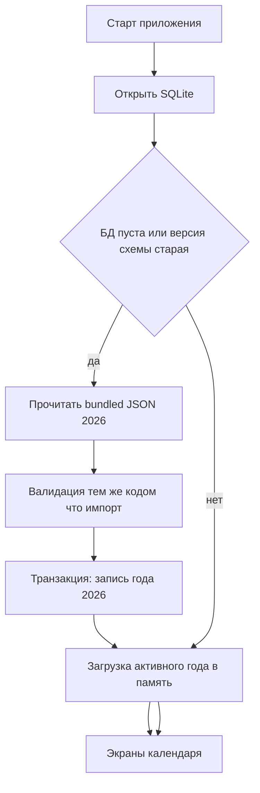

# План разработки Calendar App (React Native 0.84, Android)

Документ для product owner и команды: фазы, задачи и первый запуск с данными 2026 в SQLite.

## Текущее состояние репозитория

- Приложение — шаблон React Native (`src/app/App.tsx`), без навигации, без SQLite и без подключённого к коду бандла календаря (эталонные данные могут лежать в корне, например `calendar2026.json`).
- Требования к продукту зафиксированы в `.cursor/rules` (офлайн, SQLite как канон, импорт JSON с заменой года, экраны splash → год → месяц, настройки с импортом и темой, React Native Elements, RU/EN).

## С чего начать

1. **Зафиксировать контракт данных** — формат JSON для года 2026 (поля, типы дней: `workday` | `weekend` | `holiday` | `shortened`), правила полноты (все даты года, без дыр). Дешевле менять сейчас, чем после UI и БД.
2. **Одна дорожка валидации** — парсинг и валидация импорта и сидирования из бандла проходят через одни и те же функции, с юнит-тестами на «битый» JSON и на эталонный 2026.
3. **Только потом SQLite и экраны** — схема таблиц и миграции вытекают из доменной модели; UI читает из слоя доступа к данным, а не из сырого JSON.

### Риски и моменты на старте

- Выбор нативного SQLite-модуля под RN 0.84 и New Architecture; проверка в release без Metro.
- Первый запуск на слабом устройстве: сид не должен долго блокировать UI (splash / индикатор загрузки).
- Миграции схемы БД при обновлениях приложения.
- Локализация строк и форматов дат.
- Подтверждение пользователя перед заменой года при импорте.

## Первый запуск: календарь 2026 уже в SQLite

По правилам проекта каноническое хранилище — **SQLite**; JSON — транспорт импорта и **источник сида**.

Рекомендуемый поток:

**Примечание:** вариант с готовым `. db` в Android assets ускоряет первый запуск, но обычно дублирует источник правды с JSON. Для единого контракта с импортом предпочтительнее **bundled JSON + сид при первом открытии** (одна транзакция, та же валидация).

## Фазы и задачи

### Эпик A — Основа проекта

| ID | Задача |
|----|--------|
| A1 | Структура папок: FSD-слои `src/app`, `src/pages`, `src/widgets`, `src/features`, `src/entities`, `src/shared` (или эквивалент по правилам репозитория). |
| A2 | Зависимости: навигация (`@react-navigation/native` + native stack), UI kit (`@rneui/themed` + peer `@rneui/base`), выбор файла для импорта (например `react-native-document-picker`), SQLite — `@op-engineering/op-sqlite`. |
| A3 | Тема light/dark + персист выбора (AsyncStorage или meta в БД — минимально достаточный вариант). |

### Эпик B — Данные и качество

| ID | Задача |
|----|--------|
| B1 | TypeScript-модели и схема валидации (Zod или явные проверки) для года и дней. |
| B2 | Модуль валидации + понятные коды/сообщения ошибок для UI и отладки. |
| B3 | Юнит-тесты: валидный 2026, неполный год, неверные дни, дубликаты дат. |
| B4 | Bundled файл данных, подключаемый Metro (например `assets/data/calendar-2026.json`), согласованный с `calendar2026.json` или его заменой. |

### Эпик C — SQLite

| ID | Задача |
|----|--------|
| C1 | Схема: `app_metadata` для активного года и `calendar_days` для нормализованных дней с индексами по `year` и `(year, month)`. |
| C2 | Версионирование схемы (`PRAGMA user_version` и/или таблица migrations). |
| C3 | Репозиторий: `seedBundledYearIfNeeded`, `getActiveYear`, `getYearCalendar`, `getMonthCalendar`, `replaceActiveYear` (транзакция для импорта и атомарной замены). |
| C4 | Bootstrap при старте: если БД пуста или данные невалидны — сид из bundled `calendar2026.json` после валидации; иначе чтение из БД. |

### Эпик D — Навигация и экраны

| ID | Задача |
|----|--------|
| D1 | Splash (логотип), затем переход на главный экран года. |
| D2 | Главный экран: год целиком, меню «три точки» → настройки. |
| D3 | Экран месяца: сетка + итоги (рабочие / нерабочие / всего дней, часы при 40 ч/нед) из агрегации по БД. |
| D4 | Настройки: тема, импорт JSON, тексты RU/EN. |

### Эпик E — Импорт

| ID | Задача |
|----|--------|
| E1 | Выбор файла → чтение → валидация. |
| E2 | Диалог подтверждения замены активного года. |
| E3 | Успех: `replaceYear` в SQLite и обновление in-memory состояния; ошибка: данные не менять. |

### Эпик F — Полировка и релиз

| ID | Задача |
|----|--------|
| F1 | Touch targets, читаемость, производительность годового вида на типичном Android. |
| F2 | Вынести строки в i18n; формат дат с учётом локали. |
| F3 | Регрессия: первый запуск (сид), повторный запуск, импорт другого года, смена темы. |
| F4 | Обновить корневой `README.md` при необходимости (данные, первый запуск). |

## Критерии готовности MVP

- Первый запуск без сети: после splash пользователь видит календарь **2026**, данные в SQLite записаны (сид из бандла).
- Импорт валидного JSON заменяет год целиком с подтверждением; невалидный файл не портит текущие данные.
- Светлая и тёмная тема из настроек.
- Валидация и маппинг покрыты юнит-тестами.

## Связанные документы

- [README.md](./README.md) — оглавление документации по дизайну и продукту.
- [ACTION-PLAN.md](./ACTION-PLAN.md) — приоритизированный план правок UI в дизайн-макете.

---

*План согласован с правилами репозитория (офлайн-first, SQLite, импорт JSON, Android-ориентация).*
